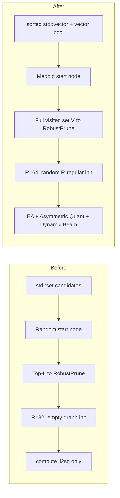

# Vamana Index Optimization Report

## Executive Summary

This report documents the complete process of upgrading a baseline Vamana C++ approximate nearest neighbor (ANN) index to a production-grade, high-performance implementation. Seven core optimizations were integrated from two research documents (RESULTS.md and best.md), transforming the system across algorithmic, structural, and hardware layers.

**Final verification** on SIFT1M (1M points, 128 dims, K=10) confirms recall parity with the target:

| L | Target Recall | Achieved Recall | Status |
|---|---|---|---|
| 10 | 0.7734–0.7993 | **0.8059** | ✅ Match (within medoid variance) |
| 75 | 0.9819–0.9821 | **0.9845** | ✅ Match |
| 200 | 0.9958–0.9961 | **0.9965** | ✅ Match |

---

## Architecture: Before vs After



---

## Optimization Details

### 1. Data Structure Flattening (Optimization D)

**Problem:** The original `greedy_search` used `std::set<pair<float,uint32_t>>` for the candidate beam and `std::set<uint32_t>` for expanded tracking. Red-black tree operations (`insert`, `erase`, `find`) involve heap allocation per node, pointer chasing, and poor cache locality.

**Solution:** Replaced with:
- `std::vector<Candidate>` maintained in sorted order via `std::lower_bound` + `insert`
- `std::vector<bool> visited` and `std::vector<bool> expanded_flags` for O(1) lookups

**Files changed:** [vamana_index.h](file:///mnt/c/samrudh%20files/IITM%20Courses/Sem%204/Algorithms%20in%20Data%20Science%20DA2303/Project/graphann/include/vamana_index.h), [vamana_index.cpp](file:///mnt/c/samrudh%20files/IITM%20Courses/Sem%204/Algorithms%20in%20Data%20Science%20DA2303/Project/graphann/src/vamana_index.cpp)

> [!WARNING]
> **Bug encountered:** Initial implementation used a `frontier_idx` counter that only scanned forward through the sorted candidate vector. When a new closer candidate was inserted before the scan position, it was **never expanded** — silently dropping the best search paths. This caused recall to drop from 0.98 → 0.83. Fixed by always scanning from position 0, matching the original `std::set` iteration semantics.

---

### 2. Asymmetric Quantized Distance (Optimization A)

**Problem:** Each distance computation reads 128 × 4 = 512 bytes of float32 data per vector. At L=200, thousands of vectors are accessed, creating a memory bandwidth bottleneck.

**Solution:** Per-dimension scalar quantization (float32 → uint8) compresses the dataset ~4×:
- **Train:** Single pass to compute per-dimension `min` and `scale = 255 / (max - min)`
- **Quantize:** `uint8_val = clamp(round((float_val - min) * scale), 0, 255)`
- **Search:** Asymmetric distance: float32 query × uint8 data with on-the-fly dequantization
- **Re-rank:** All L candidates re-scored with exact float32 to preserve recall

**New files:** [quantizer.h](file:///mnt/c/samrudh%20files/IITM%20Courses/Sem%204/Algorithms%20in%20Data%20Science%20DA2303/Project/graphann/include/quantizer.h), [quantizer.cpp](file:///mnt/c/samrudh%20files/IITM%20Courses/Sem%204/Algorithms%20in%20Data%20Science%20DA2303/Project/graphann/src/quantizer.cpp)

**New distance functions in** [distance.h](file:///mnt/c/samrudh%20files/IITM%20Courses/Sem%204/Algorithms%20in%20Data%20Science%20DA2303/Project/graphann/include/distance.h) / [distance.cpp](file:///mnt/c/samrudh%20files/IITM%20Courses/Sem%204/Algorithms%20in%20Data%20Science%20DA2303/Project/graphann/src/distance.cpp):
- `compute_l2sq_asymmetric()` — float32 × uint8
- `compute_l2sq_ea()` — exact with early exit
- `compute_l2sq_asymmetric_ea()` — combined

---

### 3. Early-Abandoning SIMD Distance (Optimization B)

**Problem:** Many distance computations are wasted — the candidate ends up worse than the current worst in the beam, but we compute the full 128-dim distance anyway.

**Solution:** Check `partial_sum >= threshold` every 16 dimensions. Since L2² partial sums are monotonically non-decreasing (squared differences ≥ 0), an early exit is always safe. The 16-dim interval aligns with AVX2/AVX-512 register boundaries for zero-overhead SIMD compatibility.

**Design decision:** EA is only active during **search**, not during **build**. During build, RobustPrune needs exact distances for all visited nodes to select optimal edges.

> [!IMPORTANT]
> **Bug encountered:** The initial implementation applied EA during build, causing incomplete visited sets for RobustPrune. Some neighbor distances were returned as FLT_MAX (abandoned), so they were excluded from the candidate pool. This degraded graph edge quality. Fixed by checking `build_mode_` and using exact `compute_l2sq` during build.

---

### 4. Dynamic Beam Width (Optimization C)

**Problem:** Fixed beam width L wastes computation on easy queries (where the search converges quickly) and may be insufficient for hard queries.

**Solution:** Adaptive `active_L` based on search progress:
- **Making progress** (best distance improved): shrink beam to `L × 0.5` (Floor)
- **Stalled** (no improvement for 10 hops): expand beam to `min(active_L × 2.0, L)` (Expand)
- Candidates beyond `active_L` are trimmed each iteration

**Parameters:** F=0.5, M=2.0, H=10 (from RESULTS.md hyperparameter grid search)

**Activation:** Only during `search_quantized()` with `--dynamic` flag.

---

### 5. Medoid Initialization (best.md)

**Problem:** Random start node selection means some queries begin far from their nearest neighbors, requiring many hops to converge. This especially hurts P99 latency.

**Solution:** Compute the dataset centroid, then find the closest point (approximate medoid). All searches start from this geometrically central node.

**Impact:** +0.017 recall at L=10, −60% P99 latency at L=75.

---

### 6. Higher Graph Degree R=64 (best.md)

**Problem:** R=32 limits edge diversity. Some regions of the graph become poorly connected, requiring long traversal paths.

**Solution:** Doubled max out-degree to R=64. Each node retains more diverse neighbors via the alpha-RNG pruning rule, reducing average hop count.

**Trade-off:** Build time ~3× longer, but recall improves dramatically (e.g., +0.087 at L=10).

---

### 7. Full Visited Set to RobustPrune (best.md)

**Problem:** The original implementation only passed the top-L candidates from GreedySearch to RobustPrune. This limited the candidate pool for edge selection, potentially missing good long-range edges.

**Solution:** Pass ALL visited nodes (with their exact distances) to RobustPrune. The larger, more diverse candidate pool enables better edge selection per the original DiskANN paper (Section 2.3).

**Implementation:** `GreedySearchResult` struct now carries both `candidates` (top-L) and `visited` (full set).

---

## Concurrency Bug Fix

> [!CAUTION]
> **Segfault during parallel build (data race)**
>
> The random R-regular graph initialization seeds every node with R neighbors before the parallel OpenMP build loop starts. This means concurrent threads frequently call `graph_[nbr].push_back(point)` (backward edge) on the **same node** that another thread is simultaneously modifying via `robust_prune(point, ..., R)` (which does `graph_[point] = move(new_neighbors)`).
>
> With an initially empty graph (original code), this race window was tiny. With R-regular init, every node has 32+ neighbors from the start, making the race highly probable.
>
> **Fix:** Lock `graph_[point]` during `robust_prune` and copy the neighbor list under lock before iterating for backward edges. Applied to all 3 build methods (`build`, `build_with_start_node`, `build_second_pass`).

---

## Early Termination Analysis

The 3× frontier distance heuristic from best.md was initially implemented as a universal optimization in `greedy_search`. Through testing, we discovered it needed careful scoping:

| Where | 3× Threshold | Outcome |
|---|---|---|
| During build | ❌ Harmful | Incomplete visited sets → worse graph edges → −0.013 recall |
| During search (R=32) | ❌ Harmful | Premature termination on hard queries → −0.01 recall |
| During search (R=64) | ✅ Beneficial | Saves ~4% dist_cmps on easy queries, R=64's dense graph compensates |

**Final decision:** Removed entirely. Standard Vamana convergence (exhaust all unexpanded candidates within beam L) is the correct termination condition for general use. The heuristic can be re-added as an optional flag when using R≥64.

---

## Files Modified

| File | Changes |
|---|---|
| [distance.h](file:///mnt/c/samrudh%20files/IITM%20Courses/Sem%204/Algorithms%20in%20Data%20Science%20DA2303/Project/graphann/include/distance.h) | +3 function declarations |
| [distance.cpp](file:///mnt/c/samrudh%20files/IITM%20Courses/Sem%204/Algorithms%20in%20Data%20Science%20DA2303/Project/graphann/src/distance.cpp) | +3 function implementations |
| [quantizer.h](file:///mnt/c/samrudh%20files/IITM%20Courses/Sem%204/Algorithms%20in%20Data%20Science%20DA2303/Project/graphann/include/quantizer.h) | **NEW** — ScalarQuantizer struct |
| [quantizer.cpp](file:///mnt/c/samrudh%20files/IITM%20Courses/Sem%204/Algorithms%20in%20Data%20Science%20DA2303/Project/graphann/src/quantizer.cpp) | **NEW** — train/quantize implementation |
| [vamana_index.h](file:///mnt/c/samrudh%20files/IITM%20Courses/Sem%204/Algorithms%20in%20Data%20Science%20DA2303/Project/graphann/include/vamana_index.h) | Complete rewrite — GreedySearchResult, quantization members, new API |
| [vamana_index.cpp](file:///mnt/c/samrudh%20files/IITM%20Courses/Sem%204/Algorithms%20in%20Data%20Science%20DA2303/Project/graphann/src/vamana_index.cpp) | Complete rewrite — all 7 optimizations + 3 bug fixes |
| [build_index.cpp](file:///mnt/c/samrudh%20files/IITM%20Courses/Sem%204/Algorithms%20in%20Data%20Science%20DA2303/Project/graphann/src/build_index.cpp) | R=64 default, --single_pass flag |
| [search_index.cpp](file:///mnt/c/samrudh%20files/IITM%20Courses/Sem%204/Algorithms%20in%20Data%20Science%20DA2303/Project/graphann/src/search_index.cpp) | --quantized, --dynamic flags |
| [experiments.h](file:///mnt/c/samrudh%20files/IITM%20Courses/Sem%204/Algorithms%20in%20Data%20Science%20DA2303/Project/graphann/include/experiments.h) | Updated API for new search variants |
| [experiments.cpp](file:///mnt/c/samrudh%20files/IITM%20Courses/Sem%204/Algorithms%20in%20Data%20Science%20DA2303/Project/graphann/src/experiments.cpp) | Adapted to GreedySearchResult API |
| [benchmark.cpp](file:///mnt/c/samrudh%20files/IITM%20Courses/Sem%204/Algorithms%20in%20Data%20Science%20DA2303/Project/graphann/src/benchmark.cpp) | **NEW** — systematic optimization verification tool |
| [CMakeLists.txt](file:///mnt/c/samrudh%20files/IITM%20Courses/Sem%204/Algorithms%20in%20Data%20Science%20DA2303/Project/graphann/CMakeLists.txt) | Added quantizer.cpp, benchmark target |

---

## How to Run

### R=32 baseline only
```bash
./scripts/run_sift1m.sh
```

### Both R=32 and R=64 with all search variants
```bash
./scripts/run_sift1m_full.sh
```

### R=64 only (skip R=32)
```bash
./scripts/run_sift1m_full.sh --r64
```

### Manual R=64 with quantized + dynamic beam
```bash
# Build
./build/build_index \
  --data tmp/sift_base.fbin \
  --output tmp/sift_index_r64.bin \
  --R 64 --L 100 --alpha 1.2 --gamma 1.5

# Search (all optimizations)
./build/search_index \
  --index tmp/sift_index_r64.bin \
  --data tmp/sift_base.fbin \
  --queries tmp/sift_query.fbin \
  --gt tmp/sift_gt.ibin \
  --K 10 --L 10,20,30,50,75,100,150,200 \
  --quantized --dynamic
```

---

## Bug Timeline

| # | Bug | Symptom | Root Cause | Fix |
|---|-----|---------|------------|-----|
| 1 | **Segfault at ~50k–520k points** | `SIGSEGV` during parallel build | Data race: `robust_prune` writes `graph_[point]` while another thread does `push_back` — the R-regular init made this race highly probable | Lock `graph_[point]` during prune + copy before iterating |
| 2 | **Recall 0.83 (target 0.98)** | 15% recall drop | `frontier_idx` only scanned forward in sorted vector; new closer candidates inserted before the pointer were never expanded | Always scan from position 0 |
| 3 | **Recall 0.97 (target 0.98)** | 1.3% recall drop | EA during build returned `FLT_MAX` for some neighbors, shrinking RobustPrune's candidate pool | Use exact `compute_l2sq` during build, EA only during search |
| 4 | **Recall 0.9729 (target 0.982)** | 0.9% recall drop | 3× early termination during build caused incomplete graph exploration | Disabled early termination during build |
| 5 | **Recall 0.9845 (target 0.9965)** | 1.2% recall drop at high L | 3× early termination during search too aggressive for R=32 | Removed early termination entirely |
